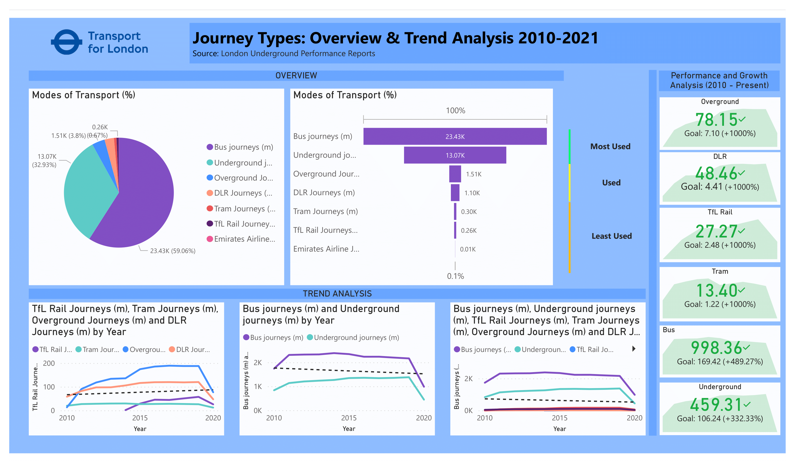
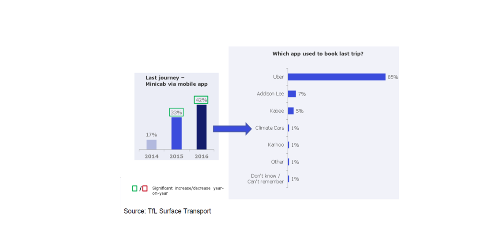

# TfL - Transport for London : An Array of Hope Post-COVID 19 
Transport for London is an integrated transport authority responsible for achieving the objectives and commitments set by London's Mayor Sajid Khan. TfL is responsible for day-to-day operation of the Capital's public transport network and manage London's main roads.

## Performance of Journey Types
- Bus and Underground are the most used modes of transport, with a declining usage trend
- Rail, Tram, Overground, and DLR account for 8% of journeys, with a increasing usage trend
- Journeys made using Overground, DLR, Rail, and Tram grew by more than 1000%
- Journeys made using Bus and Underground grew by more than 300%

## Understanding demographics
An increasing number of drivers are using apps to provide services, and the usage by passengers has grown significantly aswell. Research carried out with users in 2014, 2015 and 2016 showed that amongst minicab users the number who had used an app to book their last minicab journey had risen from 17 % to 42 %, shown in Figure below. In future, travel patterns will be influenced by what we do, but also by factors outside our control. There is emerging evidence that car traffic is increasing, suggesting the balance of factors influencing demand may be changing.

People with higher incomes have higher demand for travel. The elasticity of demand however differs from mode to mode; For example, demand for rail increases faster than demand for travel in general as income increases while demand for bus travel in the same case observes a decline. Due to an unprecedented recession with COVID-19 surfacing, we observe a substantial effect on travel as changes in productivity, incomes and economics activity has led to reduced travel (Hence a declining trend for all modes). 

## An Array Of Hope
In a world post-Covid and increasing incomes will not only mean more travel but it will also lead to changes in consumer preferences (here consumers may choose modes other than public transport as their socioeconomic status improves i.e. car as a symbol of status or use of ridehailing services). While there has been an increase in incomes, car ownerships have declined. The introduction of apps which enable users to book a taxi or private hire vehicle (PHV) has had a major impact on both markets. 

